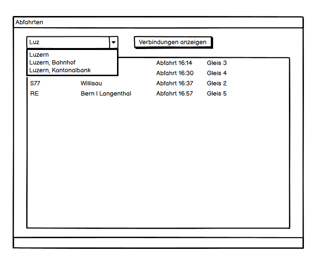
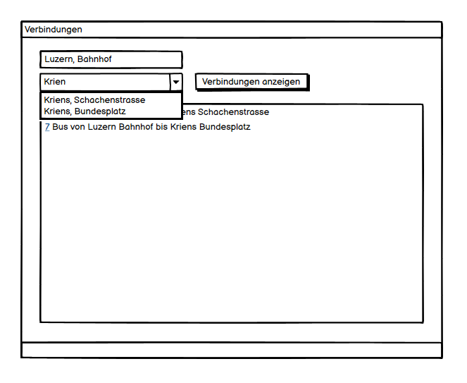

# Dokumentation

- [Dokumentation](#dokumentation)
  - [User Stories](#user-stories)
  - [Mockups](#mockups)
    - [Abfahrtstafel](#abfahrtstafel)
    - [Verbindungssuche](#verbindungssuche)

## User Stories

| ID    | User Story                                                   | Abnahmekriterien                                             | Priorität   |
| ----- | ------------------------------------------------------------ | ------------------------------------------------------------ | ----------- |
| **1** | **Verbindungssuche** Als Benutzer möchte ich mindestens die nächsten vier Verbindungen zwischen einer Start- und Endstation suchen können, um für mich eine passende Verbindung zu finden. | - Startstation in Textfeld eingeben  - Endstation in Textfeld eingeben - Listet mindestens nächsten vier Verbindungen auf | 1           |
| **2** | **Abfahrtstafel** Als Benutzer möchte ich eine Abfahrtstafel, um alle Verbindungen einer Startstation zu sehen. | - Startstation in Textfeld eingeben - Anzeigen sämtlicher ausgehender Verbindungen von dort | 1           |
| **3** | **Stationssuche** Als Benutzer möchte ich nach einer Station suchen können, um diese als Start- oder Endstation auswählen zu können. | - Anzeigen aller Stationen, die den Suchbegriff im Namen enthalten - Passende Station kann als Start-/Endstation ausgewählt werden | 1           |
| **4** | **Stationssuche Autocomplete** Als Benutzer möchte ich bei der Eingabe der Stationssuche automatisch Vorschläge erhalten, um eine Station, deren Namen ich nicht genau kenne, einfacher zu finden. | - Autovervollständigung der Eingabe bei Stationssuche - Fuzzy Search | 2           |
| **5** | **Datum und Uhrzeit Filter** Als Benutzer möchte ich ein Abfahrtsdatum und Uhrzeit eingeben können, um Verbindungen in der Zukunft einsehen zu können. | - Abfahrtsdatum auswählen - Abfahrtszeit auswählen - Entsprechende Verbindungen anzeigen | 2           |
| **6** | **Nächste Stationen** Als Benutzer möchte ich die nächsten Stationen zu meinem Standort einsehen können, um zu wissen, wo ich am besten einsteigen soll. | - Standort erfassen - Alle Stationen im nahen Umkreis anzeigen  | 3           |
| **7** | **Stationenkarte** Als Benutzer möchte ich eine Station auf einer Karte sehen können, um zu wissen, wo sich die Station befindet. | - Station auswählen - Station auf interaktiver Karte einzeichnen | 3           |
| **8** | **Verbindung teilen** Als Benutzer möchte ich eine Verbindung per Email teilen können, um andere über eine Verbindung informieren zu können. | - Verbindung auswählen - Textfeld für Empfänger-Email Adresse - Textfeld für optionale Nachricht - Uhrzeit, Start- und Endstation der Verbindung an Empfänger senden | 3           |
| **9** | **Take Me Home** Als Benutzer möchte ich einen "Take Me Home" Shortcut haben können, um mir die schnellste Verbindung von meinem aktuellen Standort zu meiner Heimadresse zu geben. | - Einstellung für Heimadresse - Standort erfassen - Nächste Startstation zum aktuellen Standort finden - Nächste Endstation zu Heimadresse finden  | Eigene Idee |

## Mockups

### Abfahrtstafel

> User Story 2

### Verbindungssuche

> User Story 1

